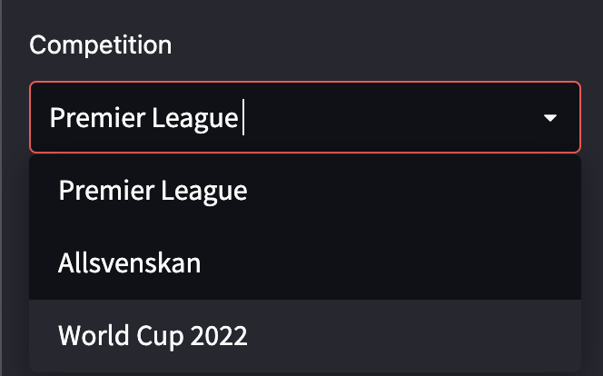
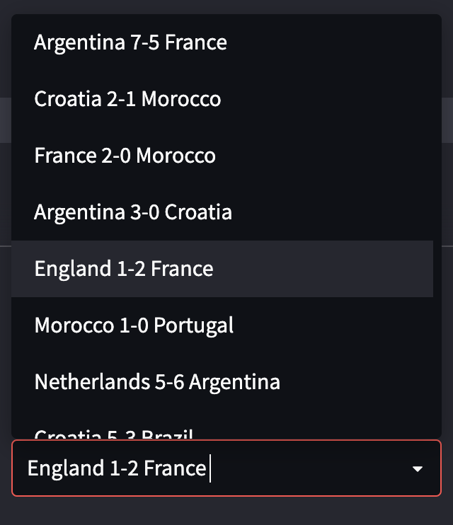
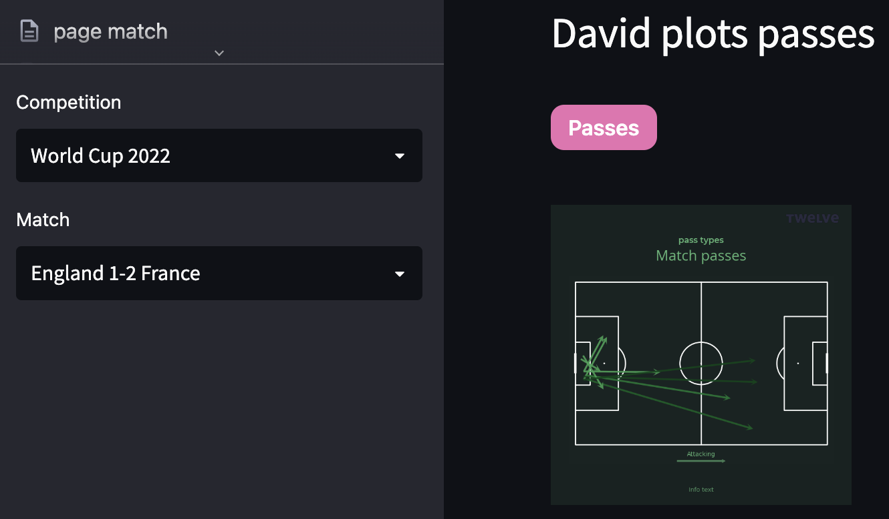

Twelve Community
================

In this video, we look through some of the Twelve community code. This provides functionality for picking a season, a match and making basic plots of shots, passes etc.

<iframe width="640" height="360" src="https://www.youtube.com/embed/KAI_tmq6SDs" title="YouTube video player" frameborder="0" allow="accelerometer; autoplay; clipboard-write; encrypted-media; gyroscope; picture-in-picture" allowfullscreen></iframe>

Below is the code from the example *davids_first_streamlit.py* I look at in the video.

We define one function for creating the sidebar. This calls the Twelve API to get the competitions, then uses *st.sidebar* to create the sidebar on the left.

    def sidebar_select_competition():
        # Single selector for competition
        competitions = twelve.competitions()
        selected_competition_id = st.sidebar.selectbox("Competition", competitions,     format_func=lambda x: competitions[x])

        return  competitions, selected_competition_id

    # Use default settings
    create_default_configs()

    st.header("David plots passes")

    # Sidebar menu
    competitions, selected_competition_id = sidebar_select_competition()

Here is how the sidebar looks:

Next we do the same for matches within the competition. Notice how we index in order to get both the teams and the score.

    # Get all available matches
    matches = twelve.app_get_matches(selected_competition_id)

    # Create Dictionary of matches
    matches_dict = {x['matchId']: f"{x['homeTeam']['name']} {x['homeTeam']['score']}-{x['awayTeam']['score']} {x['awayTeam']['name']}" for x in matches}

    # select match
    selected_match_id = st.sidebar.selectbox("Match", matches_dict, format_func=lambda x:matches_dict[x])

Here is the sidebar which the code creates

Now for the main part of the code. We make a button for passes (we could add more buttons here like we do in *page_match.py*). This calls the Twelve API to get passses 
for the selected match, which is stores in a dataframe *df_passes*. We can filter for goalkicks, throwins and passes. And we can also show passes that have more than a certain xT value (which we call Twelve points here). The ramining code creates the visual.

    # Buttons
    selected_sub_nav = st_row_buttons(['Passes'])

    if  selected_sub_nav == 'Passes':

        # get match data - passes
    
        passes = twelve.get_match_passes(selected_match_id)

        # Home Team passes
        df_passes = pd.DataFrame(passes['HomeTeamPasses'])
        df_passes = df_passes[df_passes['type'].isin(['goalkick'])] #throw-in,pass

        #Filter for passes with more than a certain number of Twelve points.
        df = df[df['points'] >= 0]

        viz = TwelvePitchVisual("Match passes", "pass types")

        viz.info_text = f"Info text"

        fig, ax = viz.create_pass_visual(df_passes['startX'],
                 df_passes['startY'],
                 df_passes['endX'],
                 df_passes['endY'],
                 df_passes['points'])

        st.columns(3)[0].pyplot(fig, dpi=100, facecolor=fig.get_facecolor(), bbox_inches=None)

        st.write(passes)

The passes are plotted in the app as follows.

The last line of the code *st.write(passes)* allows us to write out the *.json* file within the app. 

