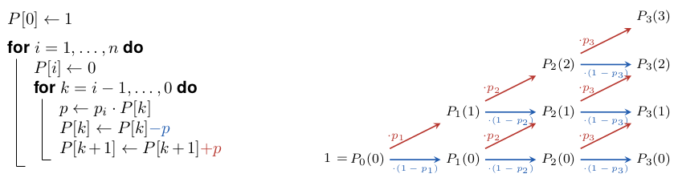

They Should Have Won
====================

After predicting future scores based on past performance,
let us now look at some counterfactual history. 
What could have been, what should have been,
given the performance of two teams in a match?
If only Kolo Muani had slotted _that_ ball past Martinez!

<iframe width="640" height="360" src="https://youtu.be/zhEWqfP6V_w?t=87" title="YouTube video player" frameborder="0" allow="accelerometer; autoplay; clipboard-write; encrypted-media; gyroscope; picture-in-picture" allowfullscreen></iframe> 

And there are so many universes
in which Italy _did_ reach the playoff final
and qualified for the 2022 FIFA World Cup,
but in this one it were North Macedonia who scored the late winner
on what was only their fourth shot at goal,
all of them from outside the box.

|shot map|xG race chart|
|:---:|:--:|
|TWELVE chart|TWELVE chart|

If a team is creating one chance after another, 
but the other scores on a long-range shot,
we feel that good or bad luck (depending on which team's side you are on) 
is involved. 
Unless you believe in the involvement of some higher powers,
or other sorts of interference,
there should be a way to quantify
just how much luck is associated with such an outcome.

For individual attempts, this has already been done in Lesson 2.
Goal probabilities quantify how likely it is that a shot results in a goal,
so that their sum over all shots tells us the number of goals to expect.
There is little surprise if a team scores one goal on 0.8 xG,
because that is, after all, close to the expectation. 
But just how surprised should we be, if they do not score
or if they score three, or four, or even more goals on the same xG?

### Quantifying luck

We will see that this very much depends on the quantity and quality of shots 
whose probabilities sum to 0.8 xG.
Assume Team P ("penalty") has a single shot with an 80% goal probability,
which happens to be a reasonable expectation for an in-game penalty,
and Team N ("normal") has eight shots with 10% goal probability each,
which is close to the average goal probability of shots in football.
Which of these teams is more likely to win?

It is intuitive that there must be differences,
because there is no way that Team P scores two goals on a single chance.
On the other hand,
the probability that all of eight 10% chances are foregone is $(1-0.1)^8 > 0.4$,
and thus much larger than the 20% of Team P missing.
Assuming that goal probabilities are independent, 
the probability that Team P wins is $0.8\cdot (1-0.1)^8 = 34%$
as this can only happen when P scores on their one shot and N fails on all eight.
There is a draw, if both teams score the same number of goals, 
so we get $0.2\cdot (1-0.1)^8=8.6%$ for a goalless draw,
$0.8\cdot 8\cdot(0.1\cdot 0.9^7)=30.6%$ for a 1-1,
or a combined chance of 39%.
As a consequence, Team N only has a 27% chance of winning. 
Despite their equal xG, Team P has a higher winning probability.

In this example, the probabilities of scoring a certain number of goals 
are obtained from binomial distributions
with the same arguments that applied
in the context of a constant scoring rate,
except that now we are not counting minutes but chances.

Chances are not, however, created equal.
What if Team N had nine shots with probabilities
0.05, 0.05, 0.05, 0.05,
0.1, 0.1,
0.15, 0.15,
and 0.2
to result in a goal?
Then, with the average goal probability still at 10%,
their combined total is 0.9 xG. 
For sure we'd expect Team N to win against Team P, wouldn't we?

If you try this on Danny Page's comprehensive
[simulator](http://dannypage.github.io/expected_goals.html?share=AwOmFYBpQ6ymCQEY6tMpm4CYA+oAHEA)
you will find that the odds are still a tiny bit in favor of Team P,
despite their lower number of expected goals.
(As we will see below, the exact numbers are slightly different, 
but in the same order.)
The simulator is accompanied by a
[detailed description](https://medium.com/@dannypage/expected-goals-just-don-t-add-up-they-also-multiply-1dfd9b52c7d0)
of this phenomenon.

It should surprise no one that there are teams and players
who go to great lengths to "win" penalties.

### 1000 Matches in the time of 1 (but exact rather than approximated)

At the time of this writing,
the above tool determines outcome probabilities by simulating 10,000 match instances
and recording relative frequencies of results. 
This is a common approach to approximate complicated distributions,
but unnecessary in the present case.

It is algorithmically feasible and indeed more efficient
to calculate probabilities directly and exactly.
It is, however, a bit more complicated than the binomial distribution,
because combinations of outcomes with the same number of goals no longer have the same probability.
The probability of Team N scoring exactly one goal
is $0.05\cdot 0.95^3\cdot 0.9^2\cdot 0.85^2\cdot 0.8=2%$ from the first of the minor chances,
but $0.95^4\cdot 0.9^2\cdot 0.85^2\cdot 0.2=9.5%$ for the biggest chance.

The generalization of the binomial distribution
to non-uniform trial probabilities $p_1,\ldots,p_n$
is called _Poisson binomial distribution_.
The probability of $k$ successful trials can be expressed as

$$ P(k)=\sum_{G\subseteq\{0,\ldots,n\}\atop |G|=k} \prod_{i\in G} p_i \prod_{i\not\in G} (1-p_i) $$

i.e., as the sum over the probabilities of all subsets of exactly $k$ successful trials.
Determining $P(0),\ldots,P(n)$ from the above formula is not efficient
because it involves calculating the probabilities for all of the $2^n$ subsets of $n$ trials.
For the nine shots of Team N, these would be a modest $512$ combinations,
but every additional shot doubles this number
so that we would have to consider more than a million possible outcomes
for a team with 20 shots at goal.
This is probably why the above simulator is indeed a simulator,
producing a limited number of subsets at random,
rather than a calculator.

As is often the case for complicated indices, 
we can save time by restructuring the computation.
Since we are not interested in knowing all the ways
in which a certain number of goals are scored, 
but only their aggregated probability,
we can build them up incrementally. 
Given a sequence of $n$ shot attempts with goal probabilities $p_1,\ldots,p_n$, 
let $P_i(k)$, $i=0,\ldots,n$ be
the probability of scoring exactly $k$ goals from the first $i$ shots. 
If we distinguish just two cases, scoring the $k$th goal on the last attempt or not, 
we need to have scored either $k-1$ or $k$ goals from the previous $i-1$ attempts,
or

$$ P_i(k)=p_i\cdot P_{i-1}(k-1) + (1-p_i)\cdot P_{i-1}(k). $$

Since, for sure, no goal is scored from no attempt, $P_0(0)=1$, 
and we can determine the probabilities of longer sequences from shorter ones one
attempt at a time.

The above code requires roughly $\frac{n(n+1)}{2}$ elementary calculations
for a sequence of $n$ shot attempts.
For $n=9$ this amounts to 45 rather than 512 calculations,
and for $n=20$ it yields 210 rather than a million. 
Even without considering that the results are exact (not approximated),
and that the code is shorter,
both numbers also compare rather favorably 
with 10,000 simulations requiring $n$ elementary computations each.
